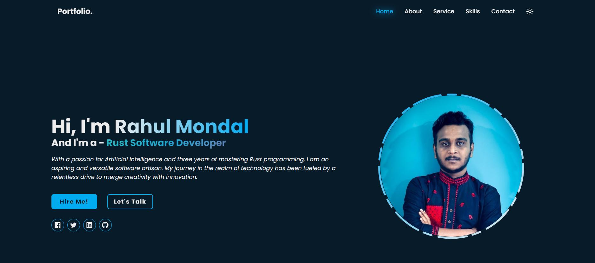

# 👋 Hi there! I'm ***Rahul***

### 🌐 `Full-Stack Software Engineer | Rust & Backend Specialist | AI & Blockchain Enthusiast`

  <!-- Portfolio Link with Screenshot -->
  
  
  <!-- Coding GIF -->
  

## 🚀 About Me

As a passionate and seasoned __Full-Stack Software Engineer,__ I specialize in **Rust Development** and have a strong interest in **AI** and **Web3** technologies. My journey in tech began as a Rust Software Developer, where I developed a deep appreciation for solving complex problems and building innovative solutions.

My goal is to continuously learn and experiment with new technologies, driving forward-thinking solutions that make a positive impact in the tech community.

## 🛠️ Technologies & Tools
- __Languages__ : 🦀 Rust, ☕ Java, 🐍 Python, 🌐 JavaScript
- __Framework__ s: ⚙️ Actix.rs, 🌊 Axum.rs, ⚛️ React.js
- __Technologies__ : 🌐 WebSockets, 📞 WebRTC, 📡 gRPC, 🔒 Hashing, 🔐 Cryptography
- __Databases__ : 🗄️ MongoDB, 🐘 PostgreSQL, 🗑️ Redis
- __Cloud & DevOps__ : ☁️ Kubernetes, 🌩️ AWS, 🐳 Docker
- __Other Tools__ :  Git, 🔄 CI/CD Pipelines

## GitHub Stats
<!-- Git Stats -->

<!-- Github Streak -->

<!-- Snake Game -->

<!-- Profile visit count -->

  

